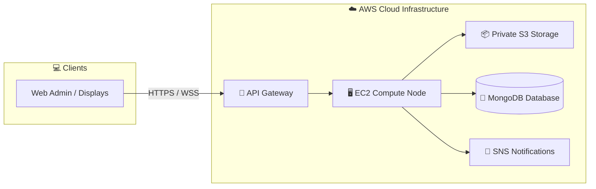

# Hi there, I'm Aurosish 👋 ☁️

### 🚀 Cloud Engineer | AWS Solutions Architect | Full-Stack Developer

I build scalable, secure, and resilient cloud-native architectures on **AWS**, specializing in serverless and microservice systems, real-time enterprise platforms, and automated CI/CD pipelines.

---

## 💫 About Me

- 🔭 **Currently Working On:** Building enterprise-grade cloud systems, infrastructure automation, and real-time distributed platforms.
- ☁️ **Cloud Focus:** AWS Infrastructure (EC2, S3, API Gateway, SNS, IAM, Lambda, VPC), Infrastructure as Code, and Containerization.
- 🎯 **Goals:** Architecting high-availability cloud solutions and mastering Advanced AWS DevOps Engineering.
- 📫 **How to reach me:** Connect with me on [GitHub](https://github.com/aurox01)!

---

## 🛠️ Tech Stack & Skills

### ☁️ Cloud & Infrastructure

### 🍃 Databases & Storage

## 📌 Featured Cloud Projects

### 📢 [Smart Notice Board System (AWS)](https://github.com/aurox01/Cloud-Based-Smart-Notice-Board)
> A cloud-native, real-time digital notice board system deployed on AWS infrastructure.
* **Architecture:** Amazon API Gateway ➔ Amazon EC2 (Node.js/Express) ➔ MongoDB (Metadata) & Amazon S3 (Files) & Amazon SNS (Notifications).
* **Key Features:** Real-time push delivery with Socket.io, multi-channel user notifications, secure IAM least-privilege policies, and automated display board synchronization.
* 🔗 **Repository:** [`aurox01/Cloud-Based-Smart-Notice-Board`](https://github.com/aurox01/Cloud-Based-Smart-Notice-Board)

---

## 🏗️ Cloud System Engineering Pattern

---

## 📈 GitHub Activity & Statistics

  

---

## 📫 Let's Connect!

- 🐙 **GitHub:** [@aurox01](https://github.com/aurox01)
- 💼 **LinkedIn:** [Connect on LinkedIn](https://www.linkedin.com/in/aurosish-swain)
- 📧 **Email:** swainaurosish@gmail.com

---

  <i>"Building the future of cloud infrastructure, one deployment at a time." ☁️🚀</i>

